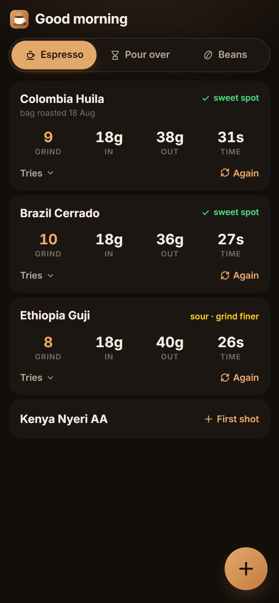
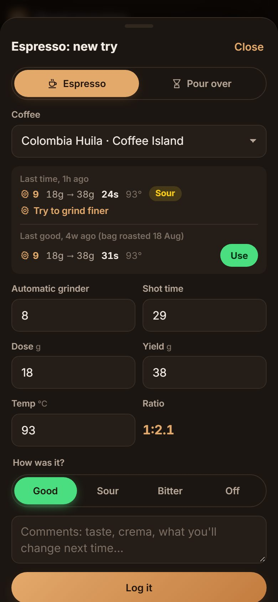
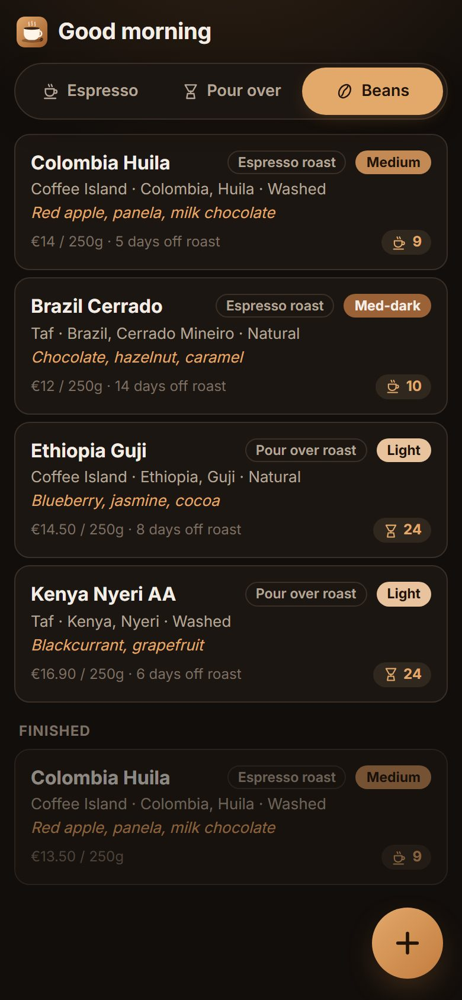
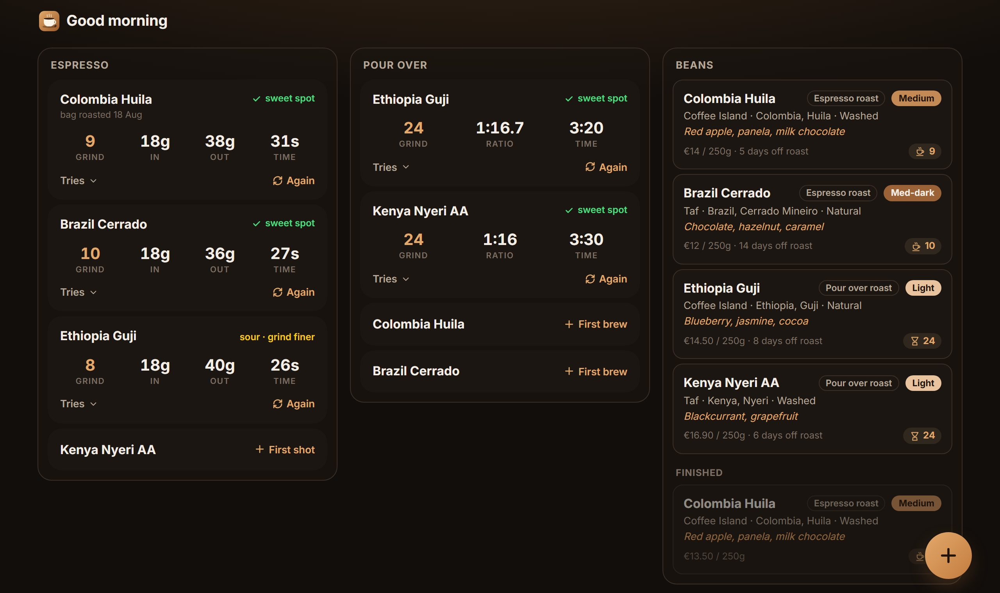

# Bean There

Your coffee beans, and every espresso and pour over you brew with them, as a Home Assistant add-on.

Add the bag you're using: where it's from, the roast, where you bought it and what it cost. Then log each brew: the
grind setting, the dose, the yield (or water), the time, and whether it was good, sour or bitter. The next one starts
from the last one, so finding the sweet spot is changing one number. Made for phones, in portrait; on a PC the three lists sit side
by side.

<p>
  
  
  
</p>
<p>
  
</p>

## Installation

Add this repository to Home Assistant:

1. Go to **Settings** → **Add-ons** → **Add-on Store**
2. Click menu (⋮) → **Repositories**
3. Add: `https://github.com/christina-thd/coffee-tracker`
4. Install **Bean There** from the store

## Add-ons

### Bean There

Log your coffee beans and find the sweet spot for every espresso and pour over.

**Features:**
- Your beans: roaster, origin, roast, price and more
- Espresso and pour over, each with its own tries
- Grind, dose, yield, time and how it tasted
- Each try starts from your last one
- The sweet spot of every coffee, at a glance
- Live on every screen

[Documentation →](./coffee-tracker/README.md)

## Development

The app is plain Node.js with no build step and no dependencies. See
[coffee-tracker/docs/DEVELOPMENT.md](./coffee-tracker/docs/DEVELOPMENT.md).

```sh
cd coffee-tracker
npm test
npm run dev
```
